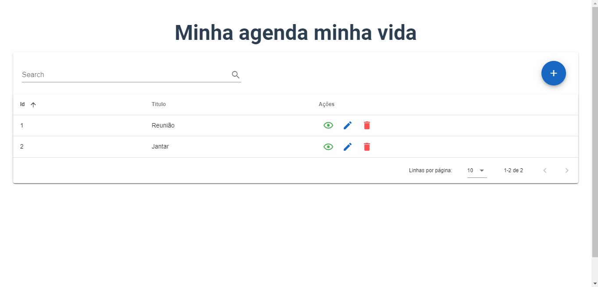

 

## Links Uteis

<li>Design no Figma: <a href="https://www.figma.com/file/DorO50WC5AHcThr3yDC2WD/Minha-Vida?node-id=0%3A1" target="_blank">Link</a></li>
<li>Online Preview: <a href="https://minhaagenda-viniciuscchagas.vercel.app/" target="_blank">Link</a></li>

## Algumas imagens do projeto

 

 

 

 

 

 
 
 
 

## Ferramentas utilizadas

### FrontEnd
<li>ReactJS</li>
<li>ContextAPI</li>
<li>TypeScript</li>

### BackEnd
<li>NodeJS</li>
<li>TypeScript</li>
<li>Express</li>
<li>MySql</li>

---

<h4 align="center">
    Feito com ♥ por Vinícius Chagas 👋 <a href="https://www.linkedin.com/in/vinicius-chagas-8b8916140/" target="_blank">Acompanhe!</a>
</h4>
